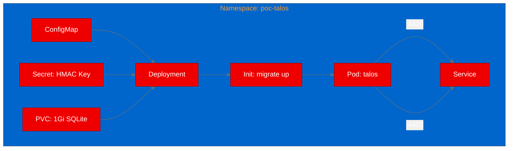

## Deploying Ory Talos on OpenShift: API key management for AI platforms

As organizations roll out inference endpoints, model registries, and agent tool APIs on OpenShift AI, one question keeps coming up: how do you manage API keys at scale? We deployed Ory Talos, an open-source API key server written in Go, to find out if it's a good fit for the job.

## What is Ory Talos?

Ory Talos is a scalable API key management server built by the Ory team (the same folks behind Ory Hydra and Ory Kratos). It handles the full API key lifecycle: issuing keys with configurable TTLs, verifying them with sub-millisecond latency, revoking them when needed, and deriving short-lived JWT or macaroon tokens from long-lived keys.

The OSS edition runs on embedded SQLite with no external database dependencies. It exposes a gRPC-Gateway REST API on port 4420 and Prometheus metrics on port 4422. Health endpoints at `/health/alive` and `/health/ready` are built in, making it Kubernetes-native from the start.

## Why API key management matters for AI platforms

AI platforms on OpenShift aren't just running models. They're running inference endpoints that external clients call, model registries that developers browse, agent runtimes that invoke tools, and pipeline services that orchestrate workflows. Every one of these services needs some form of access control.

API keys are the simplest, most widely understood authentication mechanism for service-to-service communication. A dedicated key management server like Talos gives platform teams a single place to issue, audit, and revoke access across all their AI services, without bolting ad hoc key generation into each service.

## Containerizing a Go binary on UBI

Talos compiles to a single static binary with `CGO_ENABLED=0` (it uses the pure-Go `modernc.org/sqlite` driver instead of C bindings). This makes containerization straightforward.

We wrote a two-stage UBI Dockerfile:

```dockerfile
# Stage 1: Build
FROM registry.access.redhat.com/ubi9/go-toolset AS builder
USER 0
WORKDIR /build
COPY . .
RUN go mod download
RUN CGO_ENABLED=0 go build -ldflags="-w -s" -o /tmp/talos .

# Stage 2: Runtime
FROM registry.access.redhat.com/ubi9/ubi-micro
COPY --from=builder /tmp/talos /usr/bin/talos
RUN mkdir -p /etc/talos /var/lib/talos && \
    chgrp -R 0 /var/lib/talos /etc/talos && \
    chmod -R g=u /var/lib/talos /etc/talos
EXPOSE 4420 4422
USER 1001
ENTRYPOINT ["talos"]
CMD ["serve"]
```

The `ubi-micro` runtime image is just 30 MB, and since the Talos binary is statically linked, we don't need any system libraries. The `chgrp` and `chmod` commands ensure OpenShift's random UID assignment works correctly (the random UID is always in group 0). The final image is about 50 MB total.

We built it using an OpenShift BuildConfig with binary input:

```bash
oc start-build talos-talos --from-dir=. --follow --wait
```

The build completed in about 4 minutes and pushed the image to `quay.io/aicatalyst/talos-talos:latest`.

## Deploying to OpenShift with init containers

The first deployment attempt crashed with `no such table: networks`. Talos needs its database schema initialized before it can serve requests. The upstream `docker-compose.oss.yaml` handles this with a one-shot init container that runs `talos migrate up`.

We added an init container to the Deployment:

```yaml
initContainers:
  - name: talos-migrate
    image: quay.io/aicatalyst/talos-talos:latest
    command: ["talos"]
    args: ["migrate", "up", "--database",
           "sqlite3:///var/lib/talos/talos.db?_journal_mode=WAL"]
    volumeMounts:
      - name: data
        mountPath: /var/lib/talos
```

The init container runs the migration, creates the SQLite tables, and exits. Then the main container starts `talos serve` with a healthy database ready to go.

The full deployment includes:
- A **ConfigMap** with the server configuration (CORS, logging, credential settings)
- A **Secret** with the HMAC key (minimum 32 characters, required for key derivation)
- A **PVC** (1Gi) for the SQLite database at `/var/lib/talos`
- A **Service** exposing both API (4420) and metrics (4422) ports



## Testing the API key lifecycle

We ran five test scenarios from inside the cluster using a Python test script:

**1. Health check**: `GET /health/alive` returned `{"status":"ok"}` in 20ms.

**2. Version endpoint**: `GET /version` confirmed the binary was running with the expected config hash.

**3. Create an API key**: `POST /v2alpha1/admin/issuedApiKeys` with an actor ID, name, and 1-hour TTL returned a 201 with a full key secret:

```json
{
  "issued_api_key": {
    "key_id": "ed5b8705-...",
    "status": "KEY_STATUS_ACTIVE",
    "expire_time": "2026-06-17T01:44:43Z"
  },
  "secret": "talos_v1_Qixobam7U..."
}
```

**4. Verify the key**: `POST /v2alpha1/admin/apiKeys:verify` with the secret returned `{"is_valid": true}` with the original actor ID and metadata.

**5. Metrics port**: The metrics endpoint on port 4422 responded with a healthy status.

All five scenarios passed with sub-millisecond response times.

## What we learned

**Go binaries are ideal for UBI containers.** With `CGO_ENABLED=0`, you get a single static binary that runs on `ubi-micro` with no system library dependencies. The result is a tiny, secure image.

**Init containers solve the migration problem.** Instead of running migrations on every startup (which can cause issues with multiple replicas), the init container pattern ensures the schema is ready before the server starts. This is the same pattern Talos uses in its own docker-compose setup.

**API versioning matters for testing.** Talos uses versioned paths (`/v2alpha1/admin/...`) that aren't obvious from the README. We found the correct paths by reading the OpenAPI spec shipped in the repository. Always check the spec before writing test scripts.

**SQLite works for single-instance PoCs.** For a proof of concept, embedded SQLite is perfect: zero dependencies, fast, simple. For production with horizontal scaling, you'd want the commercial edition with PostgreSQL or CockroachDB support.

## Try it yourself

The complete deployment is available at [github.com/aicatalyst-team/talos](https://github.com/aicatalyst-team/talos):

- `Dockerfile.ubi` for UBI-based container build
- `kubernetes/` directory with all manifests
- `poc_test.py` on the `autopoc-artifacts` branch for test validation

To deploy on your own OpenShift cluster:

```bash
# Clone and build
git clone https://github.com/aicatalyst-team/talos.git
oc new-build --name=talos --binary --strategy=docker
oc start-build talos --from-dir=. --follow

# Deploy
kubectl apply -f kubernetes/ -n poc-talos
```

If you're managing AI services on OpenShift and need API key management, Talos is worth evaluating. It's well-built, Kubernetes-native, and deploys in minutes.
