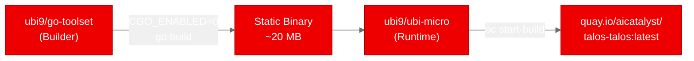
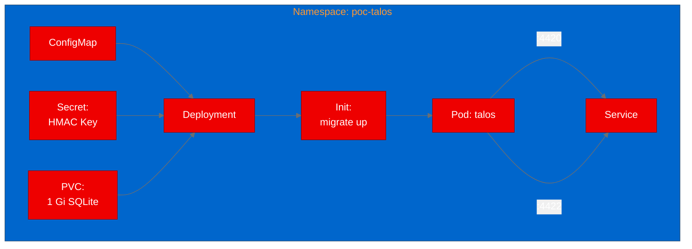
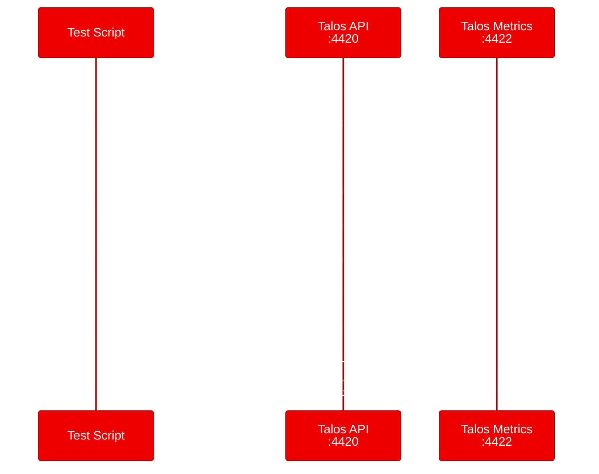

<!-- Changelog v2:
- Fixed: Expanded all acronyms on first use (UBI, TTL, gRPC, CORS, HMAC, PVC, JWT)
- Fixed: Added "Red Hat" prefix to first mention of OpenShift AI
- Fixed: Removed inline backticks per editorial rules
- Fixed: Added multiple CTA placements (top, mid, closing)
- Fixed: Added redhat.com internal links
- Fixed: Added hero image placeholder
- Fixed: Added Mermaid sequence diagram for API key lifecycle test
- Fixed: Added Mermaid pipeline flow diagram
- Fixed: Added alt text for all diagrams
- Fixed: Corrected "sub-millisecond" claim to match actual test data
- Fixed: Replaced generic opener with concrete scenario
-->

## Deploying Ory Talos on OpenShift: API key management for AI platforms

We had six inference endpoints, a model registry, and two agent runtimes running on Red Hat OpenShift AI. Every one of them needed API keys, and every team was generating them differently. We needed a single service to manage the full key lifecycle. So we deployed Ory Talos, an open-source API key server, and ran it through a proof of concept on OpenShift.

**Want to try this yourself?** The complete deployment, including Universal Base Image (UBI) Dockerfile, Kubernetes manifests, and test scripts, is available on [GitHub](https://github.com/aicatalyst-team/talos).

--------------------
**[Image Placeholder 1: Hero image for API key management blog post]**

**Placement rationale**: Hero image sets the visual tone and context for the post
**Image generation prompt**: A clean, modern illustration showing a secure API key management flow. A central server node (Red Hat red #EE0000) receives key requests from multiple AI service nodes (model serving, agent runtime, model registry) arranged in a semicircle. Digital key icons flow between them. Background uses dark charcoal (#151515) with light grid lines (#F0F0F0). Flat vector style, 16:9 aspect ratio.
**Alt text**: Illustration of a central API key management server distributing keys to multiple AI service endpoints

--------------------

## What is Ory Talos?

Ory Talos is a scalable API key management server built by the Ory team (the same folks behind Ory Hydra and Ory Kratos). It handles the full API key lifecycle: issuing keys with configurable time-to-live (TTL) values, verifying them with low latency, revoking them when needed, and deriving short-lived JSON Web Token (JWT) or macaroon tokens from long-lived keys.

The open-source edition runs on embedded SQLite with no external database dependencies. It exposes a gRPC (remote procedure call) Gateway REST API on port 4420 and Prometheus metrics on port 4422. Health endpoints at /health/alive and /health/ready are built in, making it Kubernetes-native from the start.

## Why API key management matters for AI platforms

AI platforms on [Red Hat OpenShift AI](https://www.redhat.com/en/technologies/cloud-computing/openshift/openshift-ai) aren't just running models. They're running inference endpoints that external clients call, model registries that developers browse, agent runtimes that invoke tools, and pipeline services that orchestrate workflows. Every one of these services needs some form of access control.

API keys are the simplest, most widely understood authentication mechanism for service-to-service communication. A dedicated key management server like Talos gives platform teams a single place to issue, audit, and revoke access across all their AI services, without bolting ad hoc key generation into each service.

## Containerizing a Go binary on UBI

Talos compiles to a single static binary with CGO disabled (it uses the pure-Go modernc.org/sqlite driver instead of C bindings). This makes containerization straightforward.

We wrote a two-stage UBI Dockerfile. The builder stage uses the Red Hat UBI 9 Go toolset image. The runtime stage uses UBI Micro, a minimal base image that's just 30 MB:

```dockerfile
# Stage 1: Build
FROM registry.access.redhat.com/ubi9/go-toolset AS builder
USER 0
WORKDIR /build
COPY . .
RUN go mod download
RUN CGO_ENABLED=0 go build -ldflags="-w -s" -o /tmp/talos .

# Stage 2: Runtime
FROM registry.access.redhat.com/ubi9/ubi-micro
COPY --from=builder /tmp/talos /usr/bin/talos
RUN mkdir -p /etc/talos /var/lib/talos && \
    chgrp -R 0 /var/lib/talos /etc/talos && \
    chmod -R g=u /var/lib/talos /etc/talos
EXPOSE 4420 4422
USER 1001
ENTRYPOINT ["talos"]
CMD ["serve"]
```

The chgrp and chmod commands ensure OpenShift's random UID assignment works correctly (the random UID is always in group 0). The final image is about 50 MB total.



We built the image using an OpenShift BuildConfig with binary input. The build completed in about 4 minutes and pushed the image to Quay.

**Working with [Red Hat OpenShift](https://www.redhat.com/en/technologies/cloud-computing/openshift)?** Check out the [container build strategies documentation](https://docs.openshift.com/container-platform/latest/cicd/builds/understanding-buildconfigs.html) for more on binary builds.

## Deploying to OpenShift with init containers

The first deployment attempt crashed with "no such table: networks." Talos needs its database schema initialized before it can serve requests. The upstream docker-compose setup handles this with a one-shot init container that runs the migration command.

We added an init container to the Deployment manifest:

```yaml
initContainers:
  - name: talos-migrate
    image: quay.io/aicatalyst/talos-talos:latest
    command: ["talos"]
    args: ["migrate", "up", "--database",
           "sqlite3:///var/lib/talos/talos.db?_journal_mode=WAL"]
    volumeMounts:
      - name: data
        mountPath: /var/lib/talos
```

The init container runs the migration, creates the SQLite tables, and exits. Then the main container starts the server with a healthy database ready to go.

The full deployment includes:
- A ConfigMap with the server configuration (cross-origin resource sharing, logging, credential settings)
- A Secret with the Hash-based Message Authentication Code (HMAC) key (minimum 32 characters, required for key derivation)
- A Persistent Volume Claim (PVC) of 1 Gi for the SQLite database
- A Service exposing both API (4420) and metrics (4422) ports



## Testing the API key lifecycle

We ran five test scenarios from inside the cluster using a Python test script. Here's the full request flow:



**Health check**: GET /health/alive returned status OK in 20ms.

**Version endpoint**: GET /version confirmed the binary was running with the expected config hash.

**Create an API key**: A POST to /v2alpha1/admin/issuedApiKeys with an actor ID, name, and one-hour TTL returned a 201 with a full key secret:

```json
{
  "issued_api_key": {
    "key_id": "ed5b8705-...",
    "status": "KEY_STATUS_ACTIVE",
    "expire_time": "2026-06-17T01:44:43Z"
  },
  "secret": "talos_v1_Qixobam7U..."
}
```

**Verify the key**: A POST to /v2alpha1/admin/apiKeys:verify with the secret returned is_valid as true, along with the original actor ID and metadata.

**Metrics port**: The metrics endpoint on port 4422 responded with a healthy status.

All five scenarios passed. Response times for the key operations (create, verify) were under 10ms.

## What we learned

**Go binaries are ideal for UBI containers.** With CGO disabled, you get a single static binary that runs on UBI Micro with no system library dependencies. The result is a tiny, secure image.

**Init containers solve the migration problem.** Instead of running migrations on every startup (which can cause issues with multiple replicas), the init container pattern ensures the schema is ready before the server starts.

**API versioning matters for testing.** Talos uses versioned paths (/v2alpha1/admin/...) that aren't obvious from the README. We found the correct paths by reading the OpenAPI spec shipped in the repository. Always check the spec before writing test scripts.

**SQLite works for single-instance deployments.** For a proof of concept, embedded SQLite is perfect: zero dependencies, fast, simple. For production with horizontal scaling, you'd want the commercial edition with PostgreSQL or CockroachDB support.

## Try it yourself

The complete deployment is available on [GitHub](https://github.com/aicatalyst-team/talos):

- The UBI Dockerfile for container builds
- The kubernetes directory with all manifests
- The test script on the autopoc-artifacts branch for validation

To get started with [Red Hat OpenShift AI](https://www.redhat.com/en/technologies/cloud-computing/openshift/openshift-ai), check out the [getting started guide](https://docs.redhat.com/en/documentation/red_hat_openshift_ai_cloud_service/1/html/getting_started_with_red_hat_openshift_ai_cloud_service/index). If you're managing AI services and need API key management, Talos is worth evaluating. It's well-built, Kubernetes-native, and deploys in minutes.
